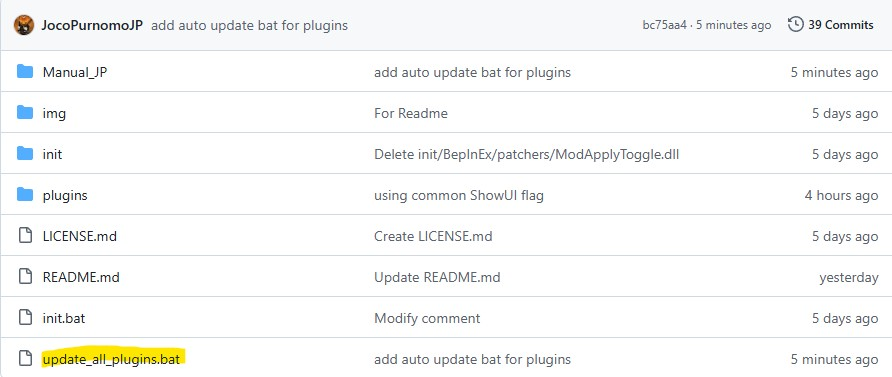

# AiArtImpostor-BepInExMods
This repository is for Unity Game AiArtImpostor PC with Mod.  
I confirmed Mods can work in Windows 11 with AiArtImpostor "ver 0.17.3" .  
This Mod is an unofficial , please observe the following when developing and using this Mod.  

1. Mod development and use is as your own risk. Please deal with any problems by yourself.  
2. Do not contact AiArtImpostor official support. This Mod is unrelated to the official channel.  
3. Secondary distribution is prohibited. Do not transfer or make this Mod in publish downloaded to the others.  

If requested by the original game developers or copyright holders, this Mod will be removed from public distribution without objection.

このRepositryはAiArtImpostorのPC版のModになります。  
Windows11とゲーム本体はver0.17.3でModが動くことを確認しております。  
非公式Modのため、本Modの利用において、以下を遵守してください。  

1. Modの開発および利用は自己責任。発生した問題については自分で対処してください。  
2. AiArtImpostorの公式に問い合わせないこと。本Modと公式は無関係です。  
3. Modの２次配布禁止。Modを他人に譲渡しないで下さい。必ず本サイトから入手してください。  

本Modについて、ゲーム開発元または著作権者からの削除要請があった場合、速やかに公開を停止いたします。

# Modを適用するためには
以下、日本語のみ対応  

Manual_JPのフォルダの中に説明書、手順書があります。  
まず「Mod適用手順書.pdf」の内容を確認し、どのようにMod適用するのか理解してください。  
Modに必要なファイルやフォルダ構成を作るためには、ルート直下にある「init.bat」を取得してください。  
  
Downloadするには先程の画像の黄色の箇所をクリックして、  
ファイル個別ページへ移動後、Downloadマークをクリックしてください。  
 
取得後はAiArtImpostor.exeがあるフォルダに移動させて、その中で実行してください。  
実行すると自動的にファイル・フォルダのDownloadが始まります。  
無事に終了すると、AiArtImpostor起動時にModが適用されます。  
Modが適用されている場合、ゲーム画面左上に「Mod Apply」というチェックボックスが表示されます。  
この状態を確認できれば、正常にModが適用されていることになります。  
任意で必要なModをpluginsフォルダから入手し、自分の環境にあるpluginsフォルダに配置してください。  
配置後、ゲームを起動することで配置したDLLをModとして適用します。  
pluginsフォルダもinit.batと同じ階層、ルート直下にあります。Download方法も同じです。  
  
どのModを適用するかはManual_JPの中にある説明書をご確認いただき、  
必要なDLLをDownloadして、pluginsフォルダに配置してください。

## init.batでエラーなどが発生した場合
力技になりますが、initフォルダの中身を手動でDownloadして、  
「Mod適用手順書.pdf」の記載されたフォルダ・ファイル構成にし、  
pluginsフォルダからModApplyToggle.dllを取得して、所定の位置に配置することでも、  
Modの適用は出来ます。  
もし、一部ファイル欠落や或いはファイルの破損があった場合は、initフォルダより直接Downloadしてください。  

## Modの選別が面倒な場合は
update_all_plugins.batを入手して、init.batと同じようにAiArtImpostor.exeと同じフォルダに配置して下さい。  
実行することで、自動的にpluginsフォルダにある最新DLLを全て取得、Mod適用に必要なBepInEx\pluginsフォルダまで  
上書き・新規作成しつつ配置します。  
各DLLの更新を確認するのが面倒な場合は、こちらをご利用下さい。    
  

# 免責 Disclaimer
当 Mod 利用によるトラブルは一切責任を負いません  
The author takes no responsibility for any issues or damages caused by the use of this Mod.

# ライセンスについて
本Modはオープンソースではありません。  
本Modの再配布は禁止されています。  
本Modの著作権その他すべての権利は開発者（Joco Purnomo）に帰属します。  
本Modは非公式のものであり、ゲームの開発元とは一切関係ありません。  

# 本リポジトリの構成
```bash
root
  ├── img                             <--- README向けの画像があるフォルダ
  ├── init                            <--- init.batでダウンロードするメイン対象フォルダ
  ├── Manual_JP                       <--- Modの適用手順書や各Modの説明書がある
  ├── plugins                         
  │   ├── ModApplyToggle.dll          <--- 他のModから参照される基幹Mod※これは環境構築時に自動的に適用されます。これがないと他のModも動きません
  │   ├── ModConcealRole.dll          <--- 配信者向け役割秘匿機能、WordWolfモードで遊ぶ機能を追加する
  │   ├── ModShowThemeList.dll        <--- 試合中に選択されたジャンル・カスタムお題の一覧を確認できる機能を追加する
  ├── init.bat                        <--- Mod適用を可能にするための環境構築・インストールBat
  ├── README.md                       <--- README本体ファイル。GitHubのリポジトリはこれを読み込んでWelcomeページとする
  ├── LICENSE.md                      <--- ライセンスについて英文で記述、２次配布禁止などを記載
  └── update_all_plugins.bat          <--- pluginsフォルダにある全ての最新DLLを自動的に取得、Local環境のBepInEx\pluginsに上書き・配置するBat
