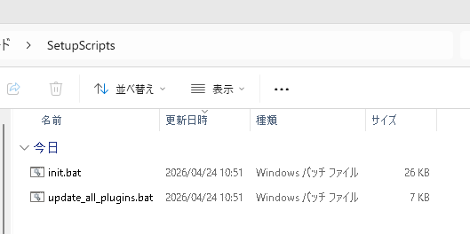
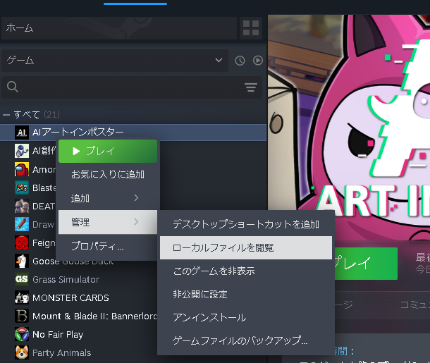
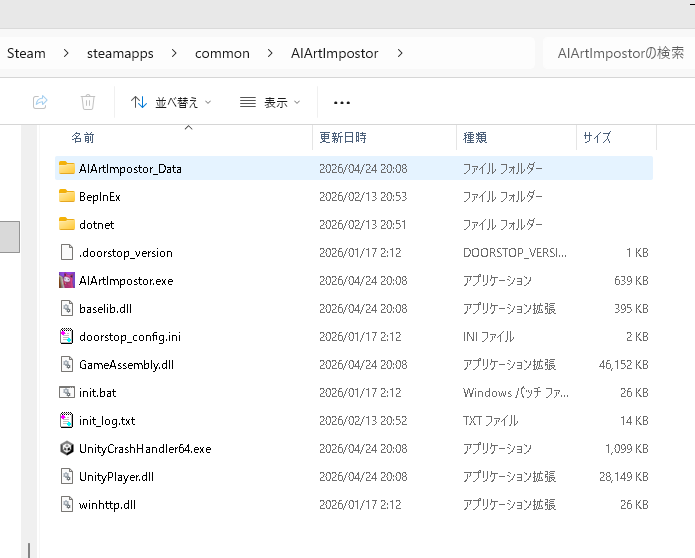
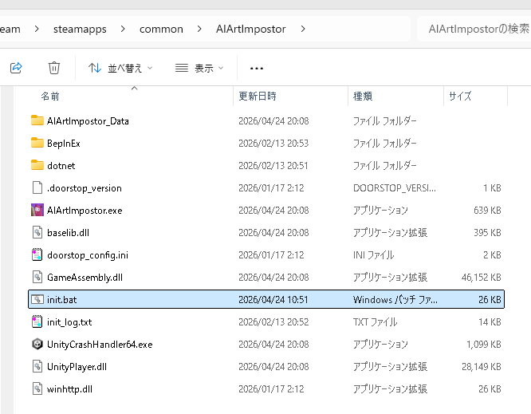
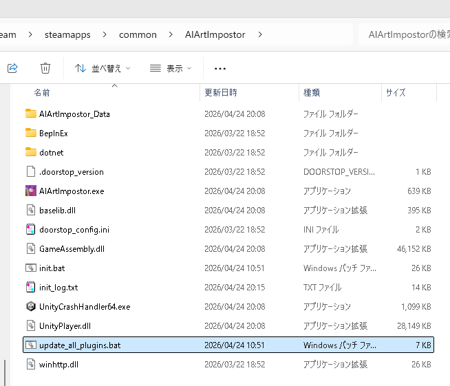
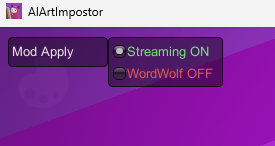

# Mod 適用手順書

## セットアップ手順

### セットアップファイルの取得
1. [リリースページ](../../../releases/latest) から `SetupScripts.zip` をダウンロードする
2. zip を解凍し、`init.bat` と `update_all_plugins.bat` を取り出す  
  

### ゲーム本体のフォルダを開く
> [!TIP]  
> 一般的なパスは `C:\Program Files (x86)\Steam\steamapps\common\AIArtImpostor`

1. Steamのライブラリ画面からAIアートインポスターを右クリックし、[管理]->[ローカルファイルを閲覧]をクリックする  
    
2. ゲーム本体のフォルダが開く  
  

### セットアップファイルの配置
開いたフォルダに`init.bat`を配置する

  

### セットアップの実行
`init.bat` を実行する

実行が完了すると、Mod の動作に必要なファイルが自動的にインストールされます。

#### インストールされるファイル

| ファイル | 配置先 |
|---|---|
| BepInEx フレームワーク一式 | ゲームフォルダ直下 |
| ModApplyToggle.dll | ゲームフォルダ\BepInEx\plugins\ |

### 追加機能のインストール

1. `update_all_plugins.bat` を `AIArtImpostor.exe` と同じフォルダに配置する  
    
2. `update_all_plugins.bat` を実行する   

### Mod適用の確認

ゲームを起動し、画面左上が画像のとおりになっていれば成功です。

## 追加機能について

利用したい機能の説明書を参照してください。

* [お題一覧表示機能](mod-show-theme-list.md)  
  ゲームプレイ中にカスタムお題の一覧を表示できる機能です。
* [カスタムお題 CSV 入力機能](mod-custom-theme.md)  
  カスタムお題をCSVファイルから入力できる機能です。
* [配信者モード・WordWolf モード](mod-conceal-role.md)

---

## エラーが発生した場合

`init.bat` の実行でエラーが発生した場合は、リポジトリの `init/` フォルダから必要なファイルを手動でダウンロードし、ゲームフォルダに配置してください。
